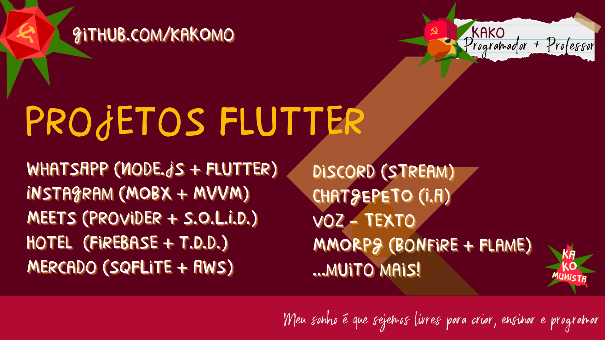
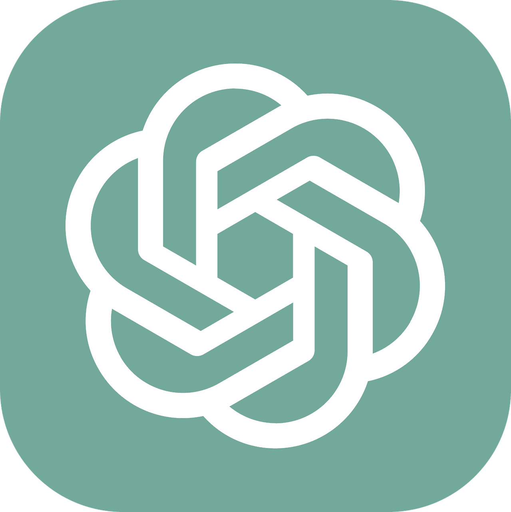

# Meus Projetos

Dê uma conferida nos projetos abertos! Você pode usar ou copiar a vontade c:

##  WhatsApp / Telegram
[GitHub](https://github.com/Kakomo/flutter-whatsapp-clone)

[Download]() 

🔨 Arquitetura ->

✔️ Gerenciamento de Estados -> 

📁 Pacotes ->

🛠️ CI/CD ->

📚 Outros ->

##  Instagram
[GitHub](https://github.com/Kakomo/SocialMedia-App)

[Download]()

🔨 Arquitetura ->

✔️ Gerenciamento de Estados -> 

📁 Pacotes ->

🛠️ CI/CD ->

📚 Outros ->


##  Ifood / Uber
[GitHub](https://github.com/Kakomo/Grocery-App)

[Download]()

🔨 Arquitetura ->

✔️ Gerenciamento de Estados -> 

📁 Pacotes ->

🛠️ CI/CD ->

📚 Outros ->


##  Meets / Discord / Skype
[GitHub](https://github.com/Kakomo/discord_open)

[Download]()

🔨 Arquitetura ->

✔️ Gerenciamento de Estados -> 

📁 Pacotes ->

🛠️ CI/CD ->

📚 Outros ->


##  ChatGPT
[GitHub](https://github.com/Kakomo/flutter_chatgpt)

[Download]()

🔨 Arquitetura ->

✔️ Gerenciamento de Estados -> 

📁 Pacotes ->

🛠️ CI/CD ->

📚 Outros ->


##  MMORPG
[GitHub](https://github.com/Kakomo/Escola)

[Download]()

🔨 Arquitetura ->

✔️ Gerenciamento de Estados -> 

📁 Pacotes ->

🛠️ CI/CD ->

📚 Outros ->

# 😄 Sobre mim

## 📁 Curriculos
Programação


Engenharia


Educação


Arte


## ✔️ Habilidades
SoftSkills

HardSkills


## 📁 Experiências Profissionais

- `Alura (2020-2025)`: leitura de dados vindos de um arquivo json
- `Hobby to Lobby`: os componentes personalizados do projeto encontram-se na pasta "components"
- `UpWork`: todas as cores utilizadas no app vêm de um arquivo chamado app_colors que aumenta o poder de personalização sem grande impacto na lógica do código.
- `BTG Pactual`: todas as imagens utilizadas no app vêm de um arquivo chamado app_images que aumenta o poder de personalização sem grande impacto na lógica do código.
- `???` nas branches a partir da aula_2 utilizamos uma biblioteca chamada [nuvigator](https://github.com/nubank/nuvigator) que nos possibilita manipular o fluxos das rotas, parâmetros, navegação aninhada e afins.
  
## 📫 Estudos

- `Engenharia de Automação e Controle - UnB`: leitura de dados vindos de um arquivo json
- `Pedagogia- UFES`: os componentes personalizados do projeto encontram-se na pasta "components"
- `Tecnólogo em EletroMecânica - IESB`: todas as cores utilizadas no app vêm de um arquivo chamado app_colors que aumenta o poder de personalização sem grande impacto na lógica do código.


## 💬 Contatos
```
├── Email
kakomo2@gmail.com
├── LinkedIN
kakomo2@gmail.com
├── Youtube
kakomo2@gmail.com
├── Instagram
kakomo2@gmail.com
├── TikTok
kakomo2@gmail.com
└── ???
```


<!--
**Kakomo/Kakomo** is a ✨ _special_ ✨ repository because its `README.md` (this file) appears on your GitHub profile.

Here are some ideas to get you started:

- 🔭 I’m currently working on ...
- 🌱 I’m currently learning ...
- 👯 I’m looking to collaborate on ...
- 🤔 I’m looking for help with ...
- 💬 Ask me about ...
- 📫 How to reach me: ...
- 😄 Pronouns: ...
- ⚡ Fun fact: ...
-->
